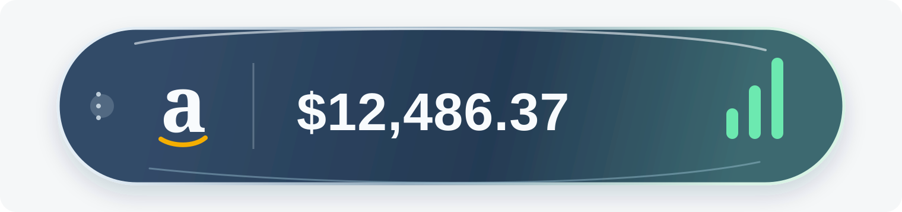
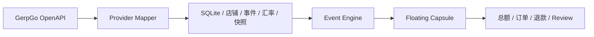

<div align="center">



# Amazon Sales Bubble

**把 Amazon 当日销售额放在桌面边缘。**

Windows / macOS 桌面悬浮胶囊 · GerpGo OpenAPI · Liquid Glass

<br />

[](package.json)
[](#快速开始)
[](docs/GERPGO_API_INVENTORY.md)
[](VALIDATION.md)

</div>

<br />

## 这是什么

Amazon Sales Bubble 是一个只保留一颗悬浮胶囊的 Windows / macOS 桌面组件。它固定显示当日销售额；订单、退款和 Review 到来时，在同一颗胶囊内短暂展示事件，随后自动回到总额。

它把数据同步、去重、汇率换算和展示动画拆开，既能连接真实 GerpGo 店铺，也能通过通用 REST 适配连接其他 ERP，或用演示模式快速检查界面。

## 产品亮点

<table>
<tr>
<td width="33%" valign="top">

### 一颗胶囊

悬浮窗只有一个视觉主体。整颗胶囊可拖动，位置自动保存，并限制在当前显示器工作区内。

</td>
<td width="33%" valign="top">

### 同一套事件流

订单、退款、Review 共用标准化事件模型，事件先展示，金额再播放变化动画，不会弹出多余窗口。

</td>
<td width="33%" valign="top">

### 可核对的数据

按店铺选择统计范围，固定每日汇率，SQLite 本地去重，并保留同步快照和游标。

</td>
</tr>
</table>

## 工作方式



| 层 | 负责内容 |
| --- | --- |
| 数据源 | GerpGo OpenAPI 或通用 REST ERP；店铺、销售表现、订单、退款、Review 和汇率 |
| 标准化 | 将官方响应映射为统一事件，过滤买家个人信息 |
| 本地状态 | SQLite 去重、店铺范围、每日汇率、销售快照和同步游标 |
| 展示状态机 | 合并高频事件，控制事件停留、总额动画和减少动态模式 |
| 桌面窗口 | 透明宿主、Liquid Glass 胶囊、拖动、置顶和位置持久化 |

> 当前版本是 floating-only：任务栏模式已移除，桌面只保留可拖动悬浮胶囊。

## 功能范围

- **销售额**：读取 GerpGo 店铺销售表现，统一换算为所选 Base Currency。
- **店铺范围**：在“市场”页按真实店铺选择范围；销售、订单、退款和 Review 使用同一组 `marketId`。
- **事件反馈**：订单绿色增加、退款红色减少、Review 显示星级与摘要；事件结束后回到总额。
- **材质调节**：设置页可调节胶囊玻璃浓度，预览和桌面悬浮版使用同一参数。
- **演示模式**：无需连接账号即可触发订单、退款、Review 和批量事件，检查动画时序。
- **数据安全**：凭证使用 Electron `safeStorage` 保存；日志会脱敏，不保存 accessToken 或买家个人信息。
- **白名单辅助**：账户页自动检测当前公网 IPv4，支持刷新和复制，方便配置 GerpGo IP 白名单。

## 快速开始

需要 Windows 或 macOS、Node.js 以及 npm。

```powershell
npm install
npm run build
npm start
```

构建便携版：

```powershell
npm run pack
```

输出位于 `release-latest/`。

构建 macOS ZIP：

```bash
npm run pack:mac
```

### 下载 Windows 便携版

从 GitHub 的 [Releases](https://github.com/yinghuo202-rgb/amazon-sales-bubble/releases) 下载 Windows `Amazon.Sales.Bubble.2.4.7.exe`，或下载 macOS Intel ZIP（Apple Silicon 通过 Rosetta 运行）。

其他 ERP 的接口字段和路径约定见 [通用 ERP REST 适配说明](docs/CUSTOM_ERP_ADAPTER.md)。

## 连接 GerpGo

打开 **设置 → 账户 → GerpGo OpenAPI**：

1. 填写官方 App ID 和 App Key。
2. 默认 Host 使用 `https://open.gerpgo.com/api/open`，通常不需要修改。
3. 在“市场”页选择参与统计的店铺；不指定店铺时使用所有启用店铺。
4. 首次同步会以 baseline 写入历史订单，不重复弹出历史事件。

如果账号开启了接口签名验证，应用会按精确 JSON 请求体和 App Key 自动计算小写 MD5 `sign`。接口清单、字段映射和已验证范围见 [GerpGo API 清单](docs/GERPGO_API_INVENTORY.md)。

## 开发与验证

```powershell
npm test       # 36 项测试
npm run build  # Vite 生产构建
npm run pack   # Electron Windows 便携包
```

主要目录：

```text
core/                   标准事件、汇率、SQLite 和展示状态机
electron/               Electron 主进程、窗口和 IPC
electron/gerpgo/        GerpGo 客户端、Mapper 和轮询器
src/                    设置页、预览和悬浮胶囊 UI
tests/                  数据、同步、汇率和展示行为测试
docs/                   产品需求、原生窗口和 API 清单
```

完整验证记录见 [VALIDATION.md](VALIDATION.md)。

## 文档

- [GerpGo API 清单](docs/GERPGO_API_INVENTORY.md)
- [产品需求](docs/PRODUCT_REQUIREMENTS.md)
- [原生窗口说明](docs/NATIVE_TASKBAR.md)
- [macOS 适配说明](docs/MACOS.md)
- [验证记录](VALIDATION.md)
- [通用 ERP REST 适配说明](docs/CUSTOM_ERP_ADAPTER.md)

## 当前边界

这是一个可交互测试版。GerpGo 真实接口已经接入并验证请求链路，但最终发布前仍应在你的 Seller Central 账号上核对店铺权限、销售统计口径和长时间运行表现。

<div align="center">

<sub>Amazon Sales Bubble · quiet numbers, right where you work.</sub>

</div>
